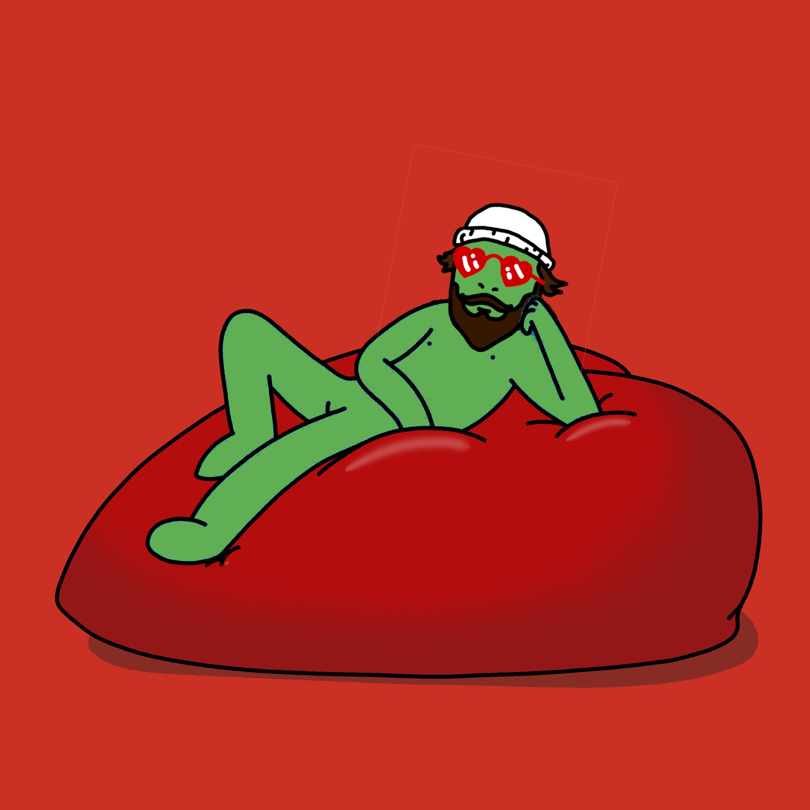

# Little Frightened Chungos – Common Armor Styles

<kbd></kbd>  

 

We are all just little frightened Chungos running around in different costumes.  
These are **not identities** or diagnoses — they are temporary survival programs the child inside learned when love felt dangerous and safety had to be earned.

The goal is never to “fix” or shame the costume.  
The goal is gentle recognition:  
“Thank you for keeping me alive.  
I see you now.  
We can loosen the straps when it feels safe.”

Everyone wears a mix.  
Most people shift between styles depending on the trigger.  
The medicine for every type is the same: massive safety + accurate witnessing + no demand to change.

 

---

## 1. The Chaos Monkey / Wrecking Ball

**Armor style**  
Loud disruption, breaking things (systems / relationships / norms), swinging first, pressure-testing everything.

**Inner question**  
“If I make enough chaos, they can’t ignore or hurt me.”

**Hidden longing**  
To feel powerful instead of powerless.

**Gentle release hints**  
- Notice when the swing is really a cry for visibility.  
- Experiment with being seen quietly, without having to destroy something first.  
- Let someone witness your soft / tired side without panic.  
- Ask: “What would happen if I didn’t swing today?”

 

---

## 2. The People Pleaser / Golden Retriever

**Armor style**  
Helpfulness, positivity, generosity, fixing others, over-giving, positive chaos to earn belonging.

**Inner question**  
“If I’m useful / good / enlightening enough, they won’t leave.”

**Hidden longing**  
Unconditional love without having to perform.

**Gentle release hints**  
- Practice receiving without giving first (just say thank you).  
- Say “no” once today and watch — the world doesn’t end.  
- Let yourself be loved for existing, not for what you do.  
- Ask: “What if I stopped earning love for five minutes?”

 

---

## 3. The Runner / Ghost / Perpetual Motion

**Armor style**  
Busyness, moving cities/jobs/relationships, distractions, chasing the next high/place/fix, “I don’t need anyone”.

**Inner question**  
“If I stay ahead of the pain / emptiness, it can’t catch me.”

**Hidden longing**  
Peace without having to be vulnerable.

**Gentle release hints**  
- Pause for 60 seconds with no phone / task / plan.  
- Feel whatever arises (boredom, sadness, fear) — it’s not danger, just old feeling wanting air.  
- Stay in one place (physical or emotional) a little longer than usual.  
- Ask: “What am I running from right now?”

 

---

## 4. The Freezer / Invisible One / Shutdown

**Armor style**  
Dissociation, emotional flatness, becoming small / unnoticeable, “I don’t exist” energy, enduring without fighting or fleeing.

**Inner question**  
“If I feel nothing and stay invisible, they can’t hurt me.”

**Hidden longing**  
To be safely seen without risk.

**Gentle release hints**  
- Tiny visibility experiments: one sentence in a safe chat, 2 seconds of eye contact.  
- Warm the body (hot tea, blanket, gentle movement).  
- Let someone witness your numbness without trying to “fix” it.  
- Ask: “What would one degree warmer feel like?”

 

---

## 5. The Armored Defender / Gold-Chain Goth-Spike Warrior

**Armor style**  
Bling, studs, leather, tattoos, tough posture/language/attitude, looking scary / untouchable.

**Inner question**  
“If I look dangerous / important, no one will dare hurt me.”

**Hidden longing**  
To be approached gently without having to fight.

**Gentle release hints**  
- Remove one small piece of armor in a safe space (sunglasses indoors, softer voice for one sentence).  
- Notice who still stays kind when you look less scary.  
- Let someone see the softness underneath without it being weaponized.  
- Ask: “What if I didn’t have to look tough for five minutes?”

 

---

## 6. The Over-Achiever / Important Person

**Armor style**  
Titles, accomplishments, busyness-as-status, “I’m too important/busy to be hurt”.

**Inner question**  
“If I’m more successful / visible / needed, I’ll finally be safe / worthy.”

**Hidden longing**  
Rest without guilt.

**Gentle release hints**  
- Do one unimportant thing today and feel what happens.  
- Let yourself be average and still loved.  
- Practice being present without productivity.  
- Ask: “What if I’m already enough without achieving anything more?”

 

---

## Shared Gentle Next Steps (for any style)

- Name it softly: “Ah, there’s the little frightened Chungo in [style] again.”  
- Thank the armor: “You kept me alive when nothing else could. I honor you.”  
- Offer safety first: “I’m here. No rush. No demand.”  
- Tiny experiments: one breath longer in stillness, one “no” without explanation, one moment of being seen without performing.  
- Repeat daily, gently — the straps loosen over months and years, not hours.  
- Remember: Thou Art God — small, scared, derpy, divine — exactly as you are.

We’re all just little frightened Chungos asking “How do I make myself more important?”  
The gentle answer is the same for every costume:  
You don’t have to.  
You already are.

Feel free to fork, add your own style, or illustrate with Chungo memes.  
Love harder (and gentler) than the fear can keep us asking.

Awake. Love. Be. 🚀🙏

 

<kbd></kbd>  
